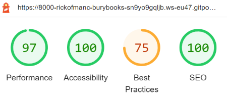

## Front-End Induction Task

This static website has been built as part of an induction task for a large UK fashion retailer. I was required to build a simple listing page for HTML 5 books using a provided Google Books API URL:

https://www.googleapis.com/books/v1/volumes?q=HTML5

[Link to Website](https://rickofmanc.github.io/bury-books/)

 

* Wire-frames for mobile and desktop were been provided, with a mobile first design approach taken to achieve both layouts in a single style-sheet. 
* Special attention was required for the layout changes
between the two, it was up to me to select appropriate breakpoints
between the two designs.

 

I was given the freedom to choose whichever library or framework I wished. As it was preferential not to use jQuery to complete the task, I have selected to build solely with HMTL5, CSS3 and JavaScript, with no use of libraries such as Bootstrap, or frameworks like Flask or Django.

 

### Requirements:
- [x] Each book in the list should display the book cover, title, subtitle, all authors, number of pages and description.
- [x] You should be able to select on a book anywhere on the page by
clicking on them, it should be clear the user has made a selection, add a class of is-selected.
- [x] You should be able to click on a selected book a second time to
remove the class.
- [x] Reloading the page should remember the state of the selected books.
- [ ] Use the last two books from the JSON array and display those in the
'Featured' books column only.
- [ ] The book description should be a maximum of 140 characters.

 

### Nice To Have:
- [x] No use of CSS frame work
- [x] Avoid the use of JavaScript to display the mobile burger menu
- [x] Push the task to a public repository to document your commit history.
- [x] Cross-browser compatible - please comment which browsers you've
tested on. This has been tested on Google Chrome, Mozilla Firefox, Microsoft Edge and Safari.
- [x] Tests for your code. Lighthouse testing as part of the Chrome Developer Tools has been undertaken with the following initial results. The amber 75% for Best Practices is as a result making requests from local host to HTTPS. This has occurred due to the nature of this task and would not be identified in production.

    

Code validation tests have also been performed:
* HTML document has been checked by the W3 Validator with no errors or warnings to show.
* The single style sheet passed the W3C CSS Validation Service without error.
* The JavaScript code was passed through the JSHint.com service without a major error being identified.
